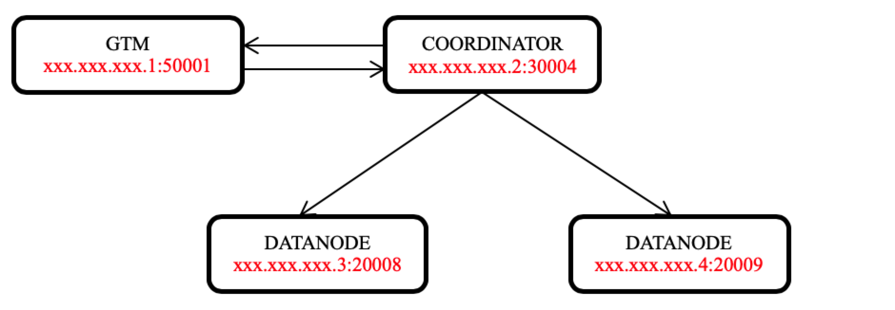
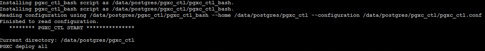
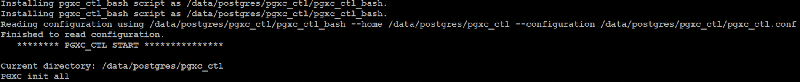

___
# TBase Database Management System
TBase is an advanced enterprise-level database management system based on prior work of Postgres-XL project. It supports an extended subset of the SQL standard, including transactions, foreign keys, user-defined types and functions. Additional, it adds parallel computing, security, management, audit and other functions.

TBase has many language interfaces similar to PostgreSQL, many of which are listed here:

	https://www.postgresql.org/download

## Overview
A TBase cluster consists of multiple CoordinateNodes, DataNodes, and GTM nodes. All user data resides in the DataNode, the CoordinateNode contains only metadata, the GTM for global transaction management. The CoordinateNodes and DataNodes share the same schema.

Users always connect to the CoordinateNodes, which divides up the query into fragments that are executed in the DataNodes, and collects the results.

The latest version of this software may be obtained at:

	http://github.com/Tencent/TBase

For more information look at our website located at:

	http://tbase.qq.com

## Building

```
cd ${SOURCECODE_PATH}
rm -rf ${INSTALL_PATH}/tbase_bin_v2.0
chmod +x configure*
./configure --prefix=${INSTALL_PATH}/tbase_bin_v2.0 --enable-user-switch --with-openssl --with-ossp-uuid CFLAGS=-g
make clean
make -sj
make install
chmod +x contrib/pgxc_ctl/make_signature
cd contrib
make -sj
make install
```

## Installation
Use PGXC\_CTL tool to build a cluster, for example: a cluster with a global transaction management node (GTM), a coordinator(COORDINATOR) and two data nodes (DATANODE).


### Preparation

1. Install pgxc and import the path of pgxc installation package into environment variable.

    ```
	PG_HOME=${INSTALL_PATH}/tbase_bin_v2.0
	export PATH="$PATH:$PG_HOME/bin"
	export LD_LIBRARY_PATH="$LD_LIBRARY_PATH:$PG_HOME/lib"
	export LC_ALL=C
    ```

2. Get through the SSH password free login between the machines where the cluster node is installed, and then deploy and init will SSH to the machines of each node. After getting through, you do not need to enter the password.

    ```
	ssh-keygen -t rsa
	ssh-copy-id -i ~/.ssh/id_rsa.pub destination-user@destination-server
    ```

### Cluster startup steps

1. Generate and fill in configuration file pgxc\_ctl.conf. pgxc\_ctl tool can generate a template for the configuration file. You need to fill in the cluster node information in the template. After the pgxc\_ctl tool is started, pgxc\_ctl directory will be generated in the current user's home directory. After entering " prepare config" command, the configuration file template that can be directly modified will be generated in pgxc\_ctl directory.

	* The pgxcInstallDir at the beginning of the configuration file refers to the installation package location of pgxc. The database user can set it according to his own needs.

	```
	pgxcInstallDir=${INSTALL_PATH}/tbase_bin_v2.0
	```

	* For GTM, you need to configure the node name, IP, port and node directory.

	```
	#---- GTM ----------
	gtmName=gtm
	gtmMasterServer=xxx.xxx.xxx.1
	gtmMasterPort=50001
	gtmMasterDir=${GTM_MASTER_DATA_DIR}/data/gtm_master
	```

	* If you do not need gtmSlave, you can directly set it to 'n' in the configuration of the corresponding node.

	```
	gtmSlave=n
	```

	If you need gtmSlave, configure it according to the instructions in the configuration file.

	* Coordination node, which needs to be configured with IP, port, directory, etc.

	```
	coordNames=(cn001)
	coordMasterCluster=(tbase_cluster)
	coordPorts=(30004)
	poolerPorts=(30014)
	coordPgHbaEntries=(0.0.0.0/0)
	coordMasterServers=(xxx.xxx.xxx.2)
	coordMasterDirs=(${COORD_MASTER_DATA_DIR}/data/cn_master/cn001)
	```

	* Data node, similar to the above nodes: IP, port, directory, etc. (since there are two data nodes, you need to configure the same information as the number of nodes.)

	```
	primaryDatanode=dn001
	datanodeNames=(dn001 dn002)
	datanodePorts=(20008 20009)
	datanodePoolerPorts=(20018 20019)
	datanodeMasterCluster=(tbase_cluster tbase_cluster)
	datanodePgHbaEntries=(0.0.0.0/0)
	datanodeMasterServers=(xxx.xxx.xxx.3 xxx.xxx.xxx.4)
	datanodeMasterDirs=(${DATANODE_MASTER_DATA_DIR}/data/dn_master/dn001 ${DATANODE_MASTER_DATA_DIR}/data/dn_master/dn002)
	```

	There are coordSlave and datanodeSlave corresponding to the coordination node and data node. If not, configure them as 'n'; otherwise, configure them according to the configuration file.

	In addition, two type ports: `poolerPort` and `port`, need to be configured for coordinator node and datanode. `poolerPort` is used by nodes to communicate with other nodes. `port` is the port used to login to the node. Here, `poolerPort` and `port` must be configured differently, otherwise there will be conflicts and the cluster cannot be started.

	Each node needs to have its own directory and cannot be created in the same directory.

2. Distribution of installation package(deploy all). After filling in the configuration file, run the pgxc\_ctl tool，and then input "deploy all" command to distribute the installation package to the IP machine of each node.


3. Initialize each node of the cluster(init all). After the distribution of the installation package is completed, input "init all" command in pgxc\_ctl tool to initialize all the nodes in the configuration file pgxc\_ctl.conf and start the cluster. So far, the cluster has been started.


## Usage

```
$ psql -h ${CoordinateNode_IP} -p ${CoordinateNode_PORT} -U ${pgxcOwner} -d postgres

postgres=# create default node group default_group  with (dn001,dn002);
CREATE NODE GROUP
postgres=# create sharding group to group default_group;
CREATE SHARDING GROUP
postgres=# create table foo(id bigint, str text) distribute by shard(id);

```

## References  

```
https://github.com/Tencent/TBase/wiki/1%E3%80%81TBase_Quick_Start
```

## License

The TBase is licensed under the BSD 3-Clause License. Copyright and license information can be found in the file [LICENSE.txt](LICENSE.txt)
